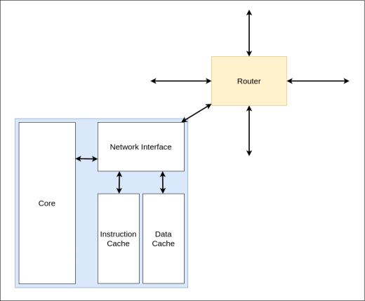
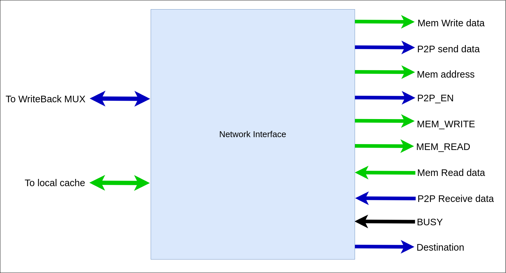

# Nodes

---

Nodes are RV32IM pipeline CPU instances. There are 16 nodes in this design and it can be scaled up. Node contains the following components,

- The core CPU components

  - ALU
  - Register File
  - Control Unit
  - Program Counter
  - Pipeline Registers

- Local Instruction cache

- Local Data Cache

- Network Interface

---

## Network Interface

Network interface is responsible for the interconnection of the node containing the CPU core and the local caches with the router. This interface provides necessary data to the router’s local node processing unit.

Inputs from the router’s local node processing unit,

- **BUSY -** This signal is asserted when the CPU needs to stall. As an example when P2P data receiving CPU should be stalled. Also When the router buffer is filled and the CPU needs to send data to the router, this signal will be asserted.
- **Mem Read Data-** This is a 4 byte long bus. This bus sends the read data which is coming from the Memory Controller.
- **P2P Receive data-** This also a 4 byte data bus which provides the receive data which is coming from another node in the network via P2P communication.

Outputs to the router's local node processing unit,

- **Mem Write Data -** This is a 16 byte data bus which will provide the memory write data to the router.
- **P2P send data -** This is a 4 byte long data bus. This will provide the data that should be sent to another node in the network via P2P communication.
- **Mem address -** This bus indicates the address that particular memory access should happen. Bus
  length is 4 byte.
- **P2P_EN -** When P2P instruction is executing, the CPU control unit will assert this signal.
- **Mem Write**
- **Mem Read**
- **Destination -** This bus will indicate the destination address that P2P communication should happen. Bus length is 4 bits long.
