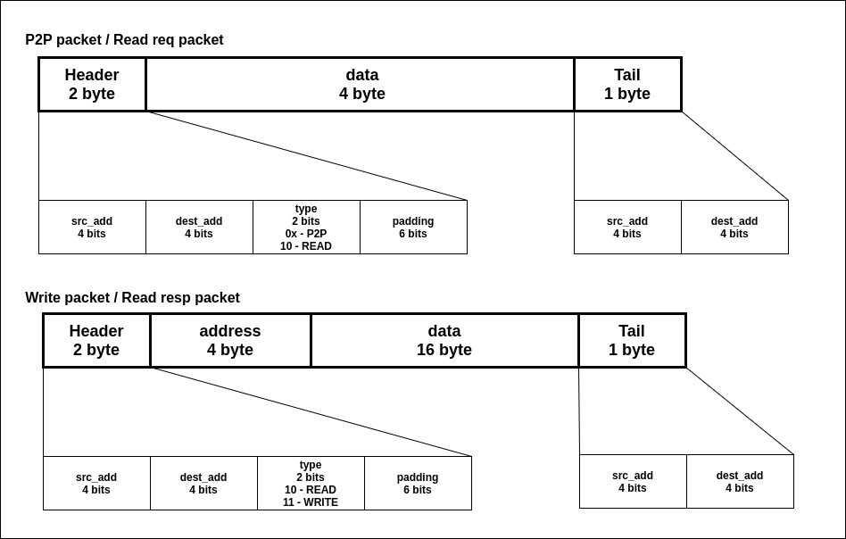
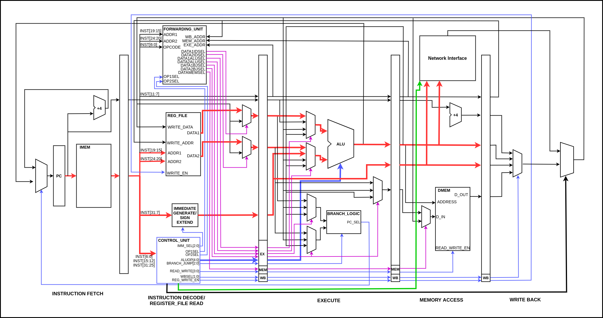
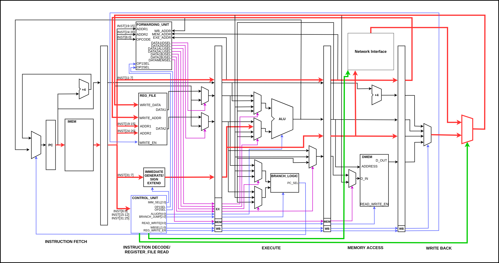

# Communication

---

## Table of Contents

1. [Packet Strucuture](#packet-structure)
2. [Point to Point Communication](#point-to-point-communication)
3. [Communication with the Memory Controller](#communication-with-the-memory-controller)
4. [Datapath for SND](#datapath-for-snd)
5. [Datapath for RCV](#datapath-for-rcv)

---

## Packet Strucuture

As shown in the figure above there are 2 types of packets transmitted in the network.

- Point to point communication packet and memory read request packet uses the same type of packet which is 7 bytes long.When two processing elements (nodes) need to share some information it uses point to point packet structure. So the data section in the packet structure refers to the data that is shared between nodes. When node wants to read from the main memory, it sends a read request packet. So the data section in the packet structure refers to the address that node wants to fetch the data from. When the memory controller receives the read request packet it fetches the data from the main memory and replies back with a read response packet.

- Read response packet and memory write packet have similar structure with a length of 23 bytes.

Both packet structures have header and tail sections. In the header packet it contains the destination address,the source address and 2 bits to indicate the type of the packet. Encodings of the header packet for identification of the type of packet is shown below.

- 0x - p2p packet
- 10 - read packet
- 11 - write packet

The tail section has the destination address and the source address. This information is used to free the allocated resources at the router when the entire packet is sent to the receiving router.

These packets are separated into 8 bit segments and each of these segments is called a flit. The communications, routing, buffering in the mesh network happens at the level of flits.

---

# Point to Point Communication

For Point to Point communication the RV32IM ISA needs an extension with 2 new instructions for sending and receiving between P2P.

- `SND <reg address> <dest node>`

Above instruction enables us to send some data stored in a register file to another node. When executing this instruction, it first reads data from the register file and supplies the data to the network interface in the memory access stage in the pipeline. So the network interface provides the data to the local processing unit of the router to create the packet. This instruction is not a blocking instruction. The data path of the instruction is shown in the below figure.

- `RCV <reg address> <dest node>`

When some node in the NoC network sends data to another node, the receiving node should wait until the data is received and store the data to a register file. Since the receiving node has to wait until the data arrives, RCV instruction is a blocking instruction.

Destination node address is encoded as an immediate value in the instruction. The data path of the RCV instruction is shown in the below figure.

---

## Communication with the Memory Controller

When a particular node wants to access a memory for reading and writing that will happen though the network via the memory controller. When a node needs to perform a read operation it should send a read request packet as mentioned earlier. Then the memory controller will reply back with a read response packet. Similarly when a node needs to perform a write operation then it should send a write packet. Then Memory controller will write the required data to the corresponding memory region depending on the request made by the node.

---

## Datapath for SND

---

## Datapath for RCV

