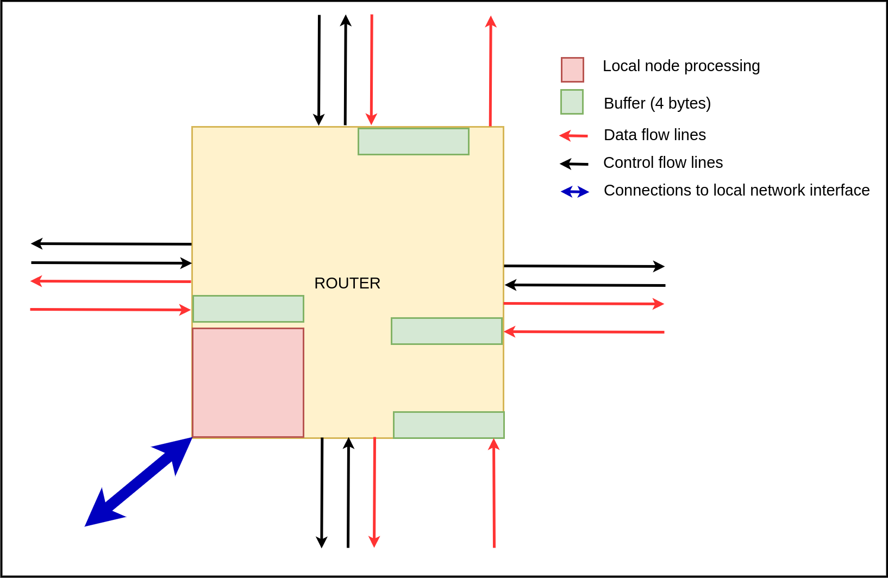
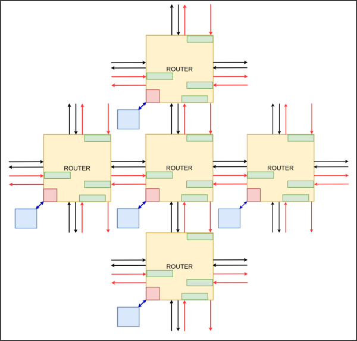
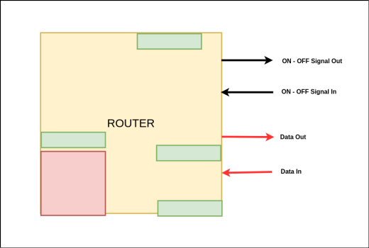
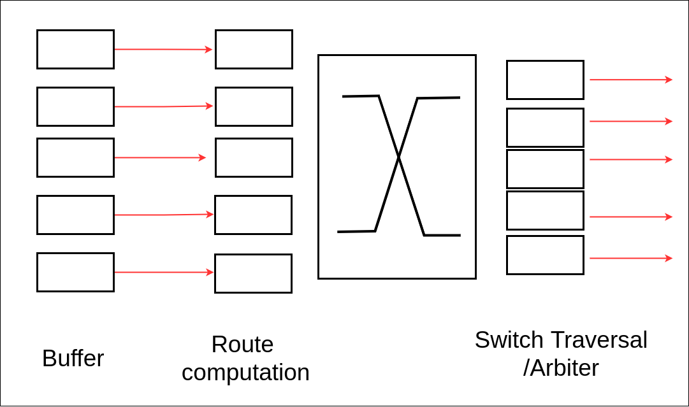
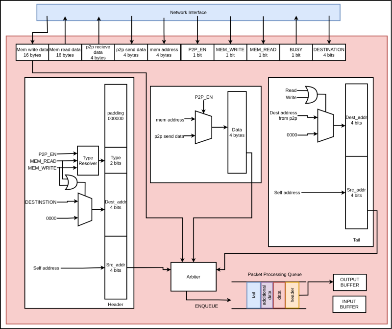

# Routers

---

## Table of Contents

1. [Routers](#routers)
2. [Flow Control Mechanism](#flow-control-mechanism)
3. [Router Design](#router-design)
4. [Route Determination Logic](#route-determination-logic)
5. [Local Node Processing Unit](#local-node-processing-unit)

---

# Routers

Routers are the main components in the mesh network. There are 16 routers in the network and they are positioned at the junctions in the network. The main functions performed by the router are,

- Creating the packets
- Disassembling the packets
- Determining the route in which the packets has to be forwarded
- Flow controlling

Each router has 4 ports to transfer the packets to neighboring routers in North, South, West, East directions and 1 port to transfer data with the network interface in the local node. The 4 ports connected to other routers have 4 channels for,

- Input data - 8 bit channel
- Output data - 8 bit channel
- Input control - 1 bit
- Output control - bit

Data channels are for transferring flits which are of 8 bits and control channels are for flow controlling. Each data input is connected to a buffer which can store 4 bytes and the buffer is connected to a 5x5 crossbar switch to direct the packets to the corresponding output. The reason for buffering the input is because the data flits have to be kept on hold until the route is computed using the header flits and buffers are used in flow controlling.

---

## Flow Control Mechanism

Flow control is used to prevent the loss of flits when transmitting. This mechanism ensures that the receiver buffer has enough empty bits in the buffer to store the incoming flits. Wormhole flow control is used as the flow control mechanism where the flow control is done at the flit level.

If the receiving router has empty 8 bits in the buffer it will assert its ON-OFF Signal Out so that the sending router will send a flit. Since the flits are of size 8 bits, a minimum of 8 bits is required in the buffer. When the buffer is full, the receiver will deassert its ON-OFF Signal Out so that the sender will stop sending. This mechanism will not overwhelm the receiver and flits will not be lost during the transmission.

However this flow control mechanism suffers from head of the line blocking. In order to overcome the head of the line blocking, virtual channel concept can be used. Each physical channel will be separated into several virtual channels and the flits of a particular packet will be sent with an allocated virtual channel. This mechanism will make the router complex therefore we thought of using the wormhole flow control mechanism.

When a flit arrives, the routing computation unit will send a channel request signal to switch allocation. If the downstream buffer at the neighboring router has vacant space, it will allocate the channel in the crossbar and flit will route through the crossbar switch towards the next router at the switch traversal stage.

---

## Router Design

Inside the router the flits will follow 4 stages.

1. **Buffer -** Flits are buffered in this stage.
2. **Route Determination -** At this stage the forwarding path will be determined by using the header flits with the help of the route determination logic.
3. **Switch Allocate -** Allocation the switch path in the 5x5 crossbar switch by looking at the forwarding path.
4. **Switch Traversal -** Once the switch path is allocated, the flits will flow from the buffer to the egress port. After all the flits of a packet are being sent, the allocated path will be freed by looking at the tail flits.

---

## Route Determination Logic

Router contains a route determination logic to decide the routing direction. Each router has a static routing table with entries to all other routers, the local node and the relevant memory controller. Altogether the routing table has 17 entries. Since these are static routes the entries have to be predetermined. These entries are predetermined with the North Last algorithm.

In the north last algorithm the north direction is determined at last in order to prevent flits moving in a loop. If the flits encounter a loop the flit will not be delivered to the destination. The north last algorithm will prevent this from happening.

Once the entire header (first 2 flits) of the packet is received the router determination logic will determine the forwarding path and allocate the path in the 5x5 crossbar switch. Then the flits can be sent in that path.

If two packets are to be sent in the same path, a round robin arbiter is used to allocate the switch path. By using an arbiter it is possible to allocate the switch path only for one packet.

---

## Local Node Processing Unit

This unit is responsible for creation and disassembling the packet. Packets will be created based on the signals coming from the network interface and when a packet is received to the local node, this unit will disassemble the packet and send the data to the respective unit in the local node.

Header and tail sections are generated as shown in the figure below. Type resolver outputs the corresponding type of the packet depending on the P2P_EN, MEM_READ and MEM_WRITE signals. After creating the separate sections of the packet each section is enqueued to a Packet Processing Queue, then forwarded to the output buffer.

