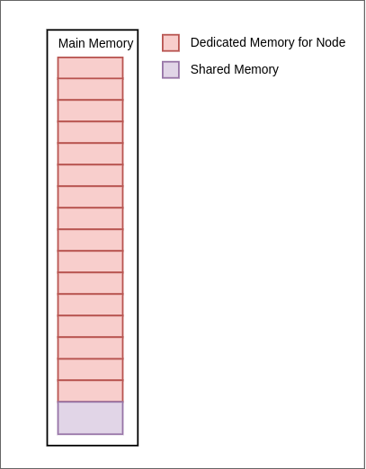
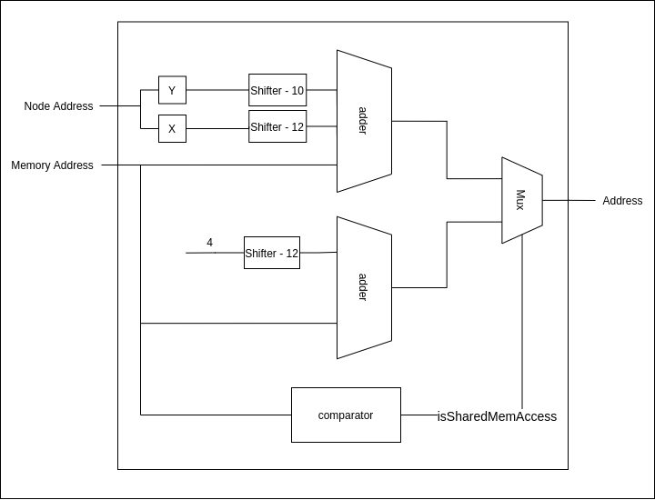
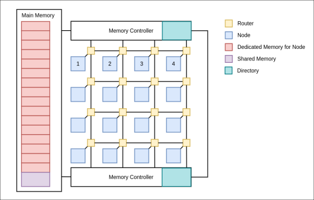
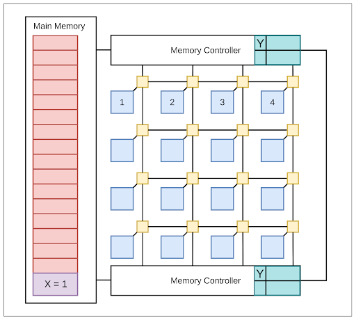
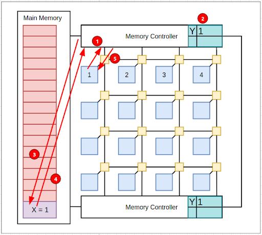
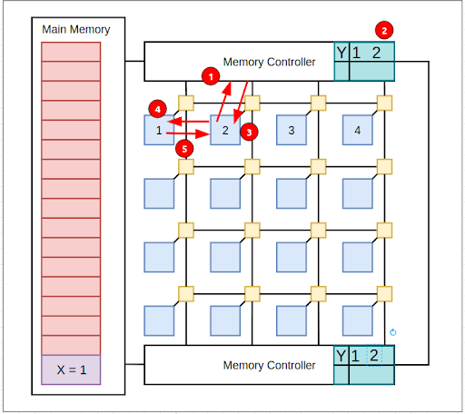
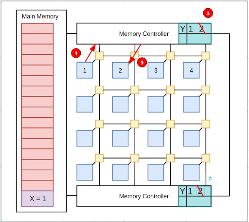
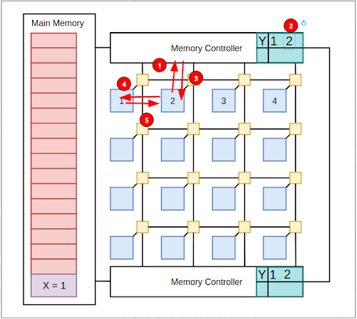

# Main Memory and Memory Controller

---

## Table of Contents

1. [Main Memory](#main-memory)
2. [Memory Controller](#memory-controller)
3. [Cache Coherency](#cache-coherency)

---

# Main Memory

Each node has been allocated a dedicated memory of 1kB. And there is a 1kB memory space shared between all the nodes in the system. Since there are 15 nodes and 1 shared space, the total main memory in our design is 17kB.

## Memory Controller

Memory controller is responsible for serving the memory requests from the nodes and maintaining the cache coherency. This unit will control which node is writing or reading the memory. Each node has 2kB of address space ( 1kB of dedicated space and 1kB of shared space).

Memory controller receives the node address and the memory address that node needs to access. Node address is 4 bits long and it generates from X and Y coordinates of the node in the network. We use these X, Y coordinates to map the node address space to the actual address space in the main memory.

First Main memory is divided into 4kB of blocks. X coordinate of the node is used to access the 4kB block. After that, Y coordinate is used to pick the correct region of the memory that node belongs to ( 1kB slot ).

Comparator is used to determine if the node accesses the memory that lies in the shared space. As you can see in the figure below it parallely calculates the dedicated memory location and the shared memory location, then picks the correct mapped address by using the result from the comparator. Then the memory controller accesses the relevant data from the memory and serves the data to the requested node.

---

## Cache Coherency

Cache coherency is maintaining the consistency of data in all the caches. Since there is a shared memory which can be accessed by all the nodes, it is required to maintain cache coherency in the local caches of each node. If there is no cache coherency the incorrect values will be used in computations. The cache coherency has to be maintained only for the shared address space.

The mechanism used to maintain the cache coherency in our design is the directory based method. The snoop bus method cannot be used in this design because the number of nodes are high and it does not suit the mesh networks.

In the directory based cache coherence mechanism there is a directory and the directory will contain entries for each shared block in the shared memory space. Since the RV32IM pipeline CPU’s cache block size is 16 bytes, the directory will contain an entry for each 16 byte block in shared memory(1kB) resulting in 64 entries in the directory. This directory is placed at the memory controller. Each entry will keep a record of the node address that contains the valid cache block.

In order to maintain the sync between the two directories in two memory controllers, a snoop bus is connected in between the memory controllers to exchange the messages related to updates in the directory controller.

Following figure shows the NoC with the directory at the memory controller.

Consider‌ ‌the‌ ‌following‌ ‌scenario,‌ ‌

1. **X‌ ‌memory‌ ‌location‌ ‌Y‌ ‌block‌ ‌contains‌ ‌value‌‌ 0**

   At the beginning of this scenario, X memory location contains 1. X is a byte in Y block. Since the local cache deals with blocks the directory entry corresponding to Y is marked in the figure.

   

2. **Node‌ ‌1‌ ‌requests‌ ‌X.‌** ‌

   Now, the CPU in node 1 tries to load the value in X memory address from the local cache but the local cache does not contain the valid block(Y). Therefore the cache needs to fetch block Y from the memory and send a request to the controller. The controller will look at the directory and the directory does not contain any node address that has Y, the directory will add the node 1 to the entry and fetch the block Y from the memory and send the block Y to the node 1’s cache.

   

3. **Node‌ ‌2‌ ‌requests‌ ‌X.‌ ‌**

   Now, the CPU in node 2 tries to load the value in X and it is not available in the local cache so the cache needs to fetch the block Y and send a request to the memory. Memory controller will look at the directory if Y and find out the node 1’s cache contains Y. Memory controller adds the node address 2 to the directory and informs node 2 that node 1 has the value in its cache. Node 2’s cache will fetch it from node 1’s cache.

   

4. **Node‌ ‌1‌ ‌updates‌ ‌the‌ ‌value‌ ‌in‌ ‌X.‌**

   Now, the node 1 updates the value X to 0 and before writing it sends a message to the memory controller. The memory controller will inform the node 2’s cache to invalidate block Y and remove node 2 from the entry in the directory.

   

5. **Node‌ ‌2‌ ‌updates‌ ‌the‌ ‌value‌ ‌in‌ ‌X.**
   ‌
   ‌Now node 2’s CPU needs the value in X and since the block is invalid the cache will fetch the block from memory. Memory controller will add node 2 to the entry and inform node 1 has the block. Node 2 will fetch the block from node 1.

   

‌
‌
