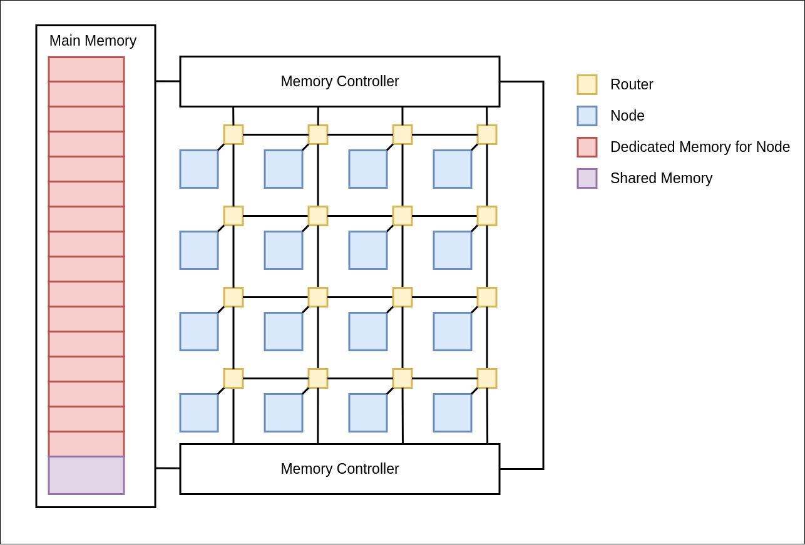

# RV32IM Network on Chip Design and Implementation

---

## Table of Contents

1. [Introduction](#introduction)
2. [Pipeline Datapath](#pipeline-datapath)
3. [Team](#team)
4. [Supervisors](#supervisors)
5. [Links](#links)

---

## Introduction

Under extended features we designed a Network of Chip to interconnect 16 RV32IM CPU instances using a mesh network. Mesh network is used by the CPU instances to communicate with other CPU instances and to access the main memory through the memory controllers. Figure 1 shows the basic design of the NoC.

As shown in Figure 1, the main hardware components of the NoC,

- Nodes
- Routers
- Main memory
- Memory Controller

[GitHub Repository](https://github.com/cepdnaclk/e16-co502-RV32IM-NoC-implementation)

---

## Overview of the Network on Chip

---

## Team

- E/16/069, Damsy De Silve, [email](mailto:e16069@eng.pdn.ac.lk)
- E/16/094, Shirly Ekanayake, [email](mailto:e16094@eng.pdn.ac.lk)
- E/16/276, Buddhi Perera, [email](mailto:e16276@eng.pdn.ac.lk)

---

## Supervisors

- Dr. Isuru Navinna
- Dr. Mahanama Wickramasinghe

---

## Links

- [Project Repository](https://github.com/cepdnaclk/e16-co502-RV32IM-NoC-implementation)
- [Project Page](https://cepdnaclk.github.io/e16-co502-RV32IM-NoC-implementation/)
- [Department of Computer Engineering](http://www.ce.pdn.ac.lk/)
- [University of Peradeniya](https://eng.pdn.ac.lk/)
